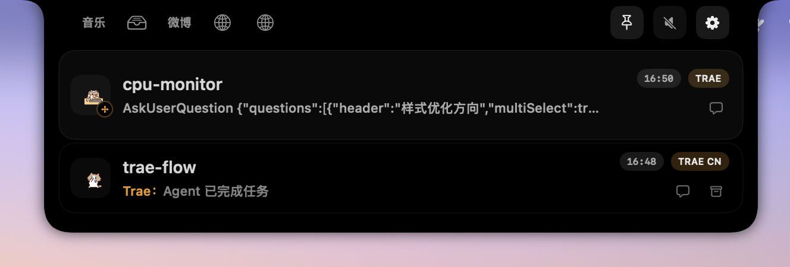
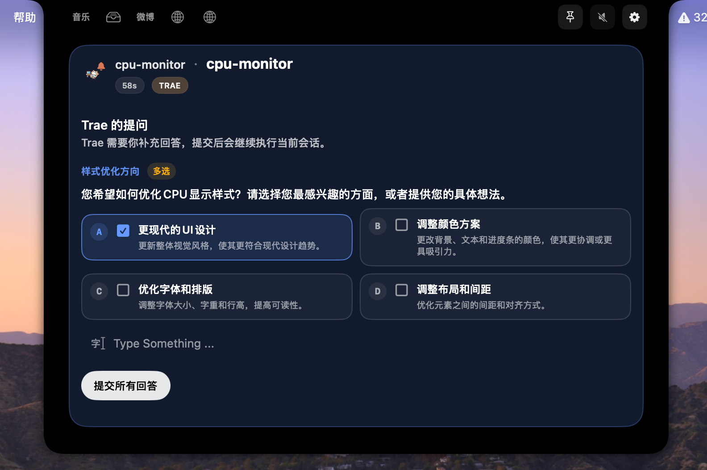
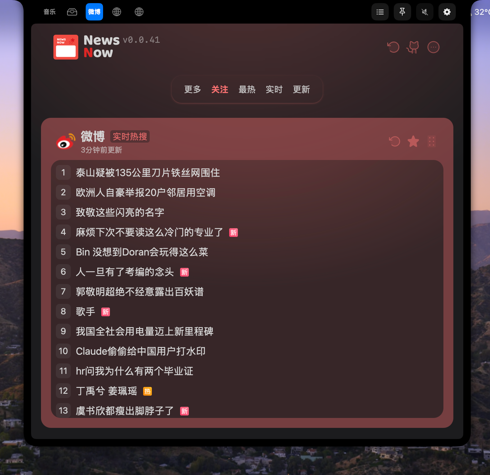
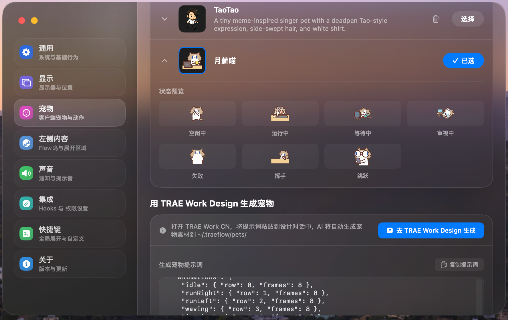
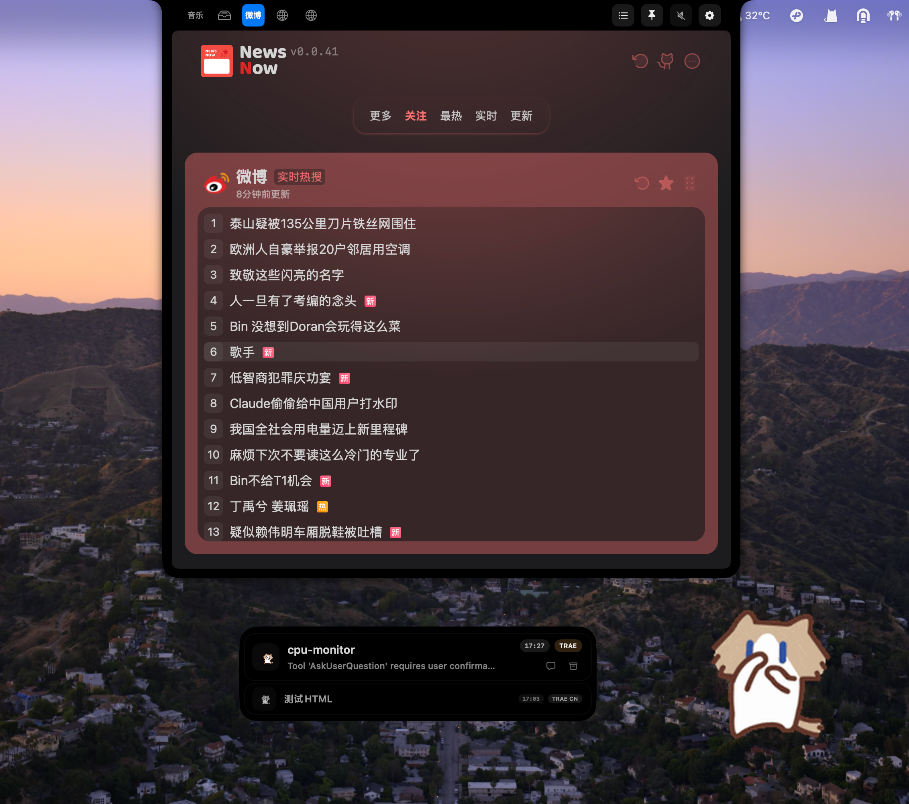
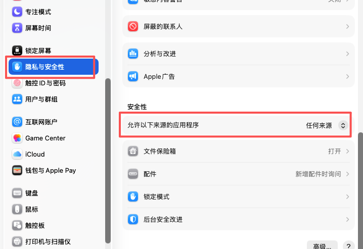

<h1 align="center">
  TRAE FLOW
</h1>
<p align="center">
  <b>使用TRAE创建专属于你的 Mac 灵动岛</b><br>
  <a href="#安装">安装</a> •
  <a href="#功能">功能</a> •
  <a href="#从源码构建">构建</a> •
  <a href="docs/privacy-policy.md">隐私政策</a>
</p>

<p align="center">
  
  
  
  
</p>

<p align="center">
  <sub>在 macOS 灵动岛上实时追踪 TRAE 任务，自由组合音乐/中转站/NewsNow/Mineradio/自定义网页组件，还有陪伴编码的桌面宠物。</sub>
</p>

## 什么是 TRAE FLOW？

TRAE FLOW 是一款 macOS 灵动岛应用，当你的 TRAE 编码代理需要关注时，它会展开为一个紧凑的灵动岛风格面板。它监听 Trae 官方 Hook 事件，将审批请求、输入提示、任务完成和会话摘要展示在界面中，无需时刻盯守终端标签页。

除了会话监控，TRAE FLOW 还内置了**音乐控制**和**文件中转站**功能，并支持在灵动岛中嵌入自定义 HTML 页面或远程网页。

TRAE FLOW 延续了 [ping-island](https://github.com/erha19/ping-island) 和 [vibe-notch](https://github.com/farouqaldori/vibe-notch) 的会话监视器理念，专注于TRAE，提供左右分区 Flow 岛 UI、丰富的内置功能和添加了自定义能力，方便用户可以添加任意想要显示的内容，以及一键跳回任意 TRAE 变体的能力。

## 功能

- **TRAE 任务灵动岛** — 同时监视 TRAE、TRAE CN、TRAE WORK 和 TRAE WORK CN，紧凑态显示各变体任务计数，展开态呈现审批、追问、完成详情，并一键跳回对应 IDE 窗口。
- **自定义组件** — 灵动岛左侧功能槽自由组合音乐、中转站、NewsNow、Mineradio、本地 HTML 自定义区域和远程网页嵌入，支持拖拽排序、独立开关和展开尺寸记忆。
- **🐱 桌面宠物** — 基于精灵表动画的 Codex 兼容宠物系统，可在 Flow 岛和桌面显示，支持拖拽.detach、滚轮缩放，内置多套主题包。
- **🎵 音乐控制** — 系统「正在播放」面板，支持 Music.app、Spotify、网易云音乐、QQ 音乐。紧凑态显示封面与曲目，展开态提供进度条拖拽和完整播放控制；正在播放时自动切换到紧凑态。
- **📦 中转站** — 文件暂存区，支持拖入文件，展开态以网格展示，可通过 AirDrop 一键分享全部文件。
- **📰 NewsNow** — 内置 NewsNow 远程实例，在灵动岛中快速浏览新闻资讯。
- **⛏ Mineradio** — 内置 Mineradio Bridge 兼容层，在灵动岛内播放音乐并显示歌词，支持网易云/QQ/酷狗登录。
- **📄 自定义区域** — 将本地 HTML 文件夹渲染到灵动岛中，支持 JS Bridge 向紧凑态推送限时通知。首次启动预置「TRAE Flow 演示」示例（默认不启用，可在设置中手动开启）。
- **🌐 网页嵌入** — 在灵动岛中直接嵌入任意远程网页，支持自定义名称、URL 和图标，并保持后台运行。
- **Trae 官方 Hook** — 对接 Trae 官方 Hook 系统（`~/.trae-cn/hooks.json` 全局，`$PROJECT/.trae/hooks.json` 项目级），支持 `variant` 字段路由。
- **一键跳回 IDE** — 从灵动岛直接跳回对应 TRAE 变体 IDE 窗口并定位到相关会话。

<a id="支持的变体"></a>

## 支持的变体

| 变体           | Bundle ID           | URL Scheme   | 官方 Hook                 | Profile ID     |
| ------------ | ------------------- | ------------ | ----------------------- | -------------- |
| TRAE         | `com.trae.app`      | `trae://`    | `~/.trae/hooks.json`    | `trae`         |
| TRAE CN      | `cn.trae.app`       | `trae-cn://` | `~/.trae-cn/hooks.json` | `trae-cn`      |
| TRAE WORK    | `com.trae.solo.app` | `solo://`    | 暂未支持                    | `trae-work`    |
| TRAE WORK CN | `cn.trae.solo.app`  | `solo-cn://` | 暂未支持                    | `trae-work-cn` |

TRAE 和 TRAE CN 支持 Trae 官方 Hook 系统，包含 `SessionStart`、`UserPromptSubmit`、`PreToolUse`、`PostToolUse`、`Stop` 和 `Notification` 事件。TRAE WORK 和 TRAE WORK CN 暂无官方 Hook 支持（`supportsOfficialTraeHook = false`）。

Bridge 通过 `--variant <value>` 命令行参数区分变体事件来源，因为 Trae 官方 Hook 的 stdin JSON 不包含 variant 字段。

## Flow 岛布局

### 紧凑态


- **左侧**：当前选中的功能视图（音乐 / 中转站 / NewsNow / Mineradio / 自定义区域 / 网页），正在播放音乐时自动切换到音乐。
- **右侧**：TRAE sparkles 图标 + 所有变体待处理/正在运行任务总数。

### 展开态




- **顶部**：功能切换栏，支持拖拽排序。
- **左侧**：当前功能的展开内容，或活跃会话详情（审批、追问、完成）。
- **右侧**：各变体待处理任务计数及跳回 IDE 按钮。

## 内置功能

### 🎵 音乐

系统「正在播放」面板，无需离开编码环境即可查看和控制音乐播放。

- **支持播放器**：Music.app、Spotify、网易云音乐、QQ 音乐
- **技术实现**：通过 MediaRemote 私有框架（dlopen 动态加载）获取系统级播放信息，AppleScript 作为备用方案
- **紧凑态**：18pt 圆角封面缩略图 + 截断曲目标题，无播放时显示灰色音符图标
- **展开态**：140pt 封面大图 + 曲目/艺术家/专辑信息 + 可拖拽进度条 + 完整播放控制（上一曲 / 播放暂停 / 下一曲），背景为封面主色调动态渐变

### 📦 中转站

轻量级文件暂存区，方便在不同应用间快速传递文件。

- **添加文件**：从任意位置拖入文件
- **分享文件**：通过 AirDrop 一键分享暂存的所有文件
- **管理文件**：展开态以 4 列网格展示图标和文件名，右键可移除单个文件
- **注意**：中转站文件仅在内存中暂存，退出应用后自动清空

### 📄 自定义区域

在灵动岛中渲染本地 HTML 目录和外部网站URL，支持完整的 Web 交互能力。




- **JS Bridge**：HTML 页面可调用 `window.webkit.messageHandlers.traeFlowHint.postMessage()` 向紧凑态推送限时通知
- **文件监听**：通过 FSEvents 监听文件变化，自动刷新 Flow 岛和设置预览
- **安全沙箱**：WebView 默认限制外部网络访问和 JavaScript 窗口创建；可配置允许网络访问和 `fetch` 请求
- **书签持久化**：沙箱外目录通过 Security-Scoped Bookmark 持久化访问权限

#### 预置示例

首次启动时自动创建一个自定义区域（默认不启用，可在设置 > 左侧内容中手动开启）：

| 区域               | 说明                                                        |
| ---------------- | --------------------------------------------------------- |
| **TRAE Flow 演示** | 交互式模板，展示 JS Bridge 推送提示、外部 API 请求、localStorage 计数器和系统数据监控 |

### 🌐 网页嵌入

在灵动岛中直接加载远程网页，支持编辑名称、URL 和图标，可在系统默认浏览器中打开当前页面，并可选择收起灵动岛后保持网页后台运行。

### 📰 NewsNow

内置 NewsNow 远程实例，无需配置即可在灵动岛中快速浏览新闻资讯。支持自定义实例地址，自动获取站点图标。

### ⛏ Mineradio

内置 Mineradio Bridge 兼容层，在灵动岛内直接播放 [Mineradio](https://mineradio.art/) 音乐并展示歌词。

- **平台支持**：网易云音乐、QQ 音乐、酷狗音乐
- **歌词显示**：紧凑态可展示当前歌词，展开态浏览完整播放器
- **后台播放**：收起灵动岛后仍通过离屏窗口保持 WebView 运行，音乐不间断
- **登录同步**：登录状态通过默认 Cookie 存储共享，支持在设置中查看/登出

### 🐱 内置宠物

基于精灵表（spritesheet）动画的桌面宠物系统，兼容 Codex 宠物规范。宠物会在 Flow 岛中展示不同状态的动画（空闲、运行、等待、跳跃等），陪伴编码过程。



支持将宠物拖拽到桌面显示，鼠标滚轮可调整宠物显示大小。

#### 内置宠物主题包

| 宠物             | ID           | 类型 |
| -------------- | ------------ | -- |
| **TRAE FLOW**  | `traeflow`   | 默认 |
| **月薪喵**        | `yuexinmiao` | 动物 |
| **光环小猫**       | `halokitten` | 动物 |
| **鸡哥 ikun**    | `ikun`       | 动物 |
| **Frieren**    | `frieren`    | 人物 |
| **Homelander** | `homelander` | 未知 |
| **Shinchan**   | `shinchan`   | 未知 |
| **TaoTao**     | `taotao`     | 人物 |

宠物主题包遵循 Codex 规范的 8 列 × 9 行精灵表格式（1536×1872，每帧 192×208），支持在设置面板中切换、预览，也支持从 `~/.traeflow/pets/` 或 `~/.codex/pets/` 加载自定义宠物。

<br />

## 安装

### 下载发布版本

1. 前往 [Releases](https://github.com/ccsonicc333/trae-flow/releases)。
2. 下载最新的 DMG。
3. 将 `TRAE FLOW.app` 拖到应用程序文件夹。
4. 启动应用并打开你要监视的 TRAE 变体。

> 首次启动时，macOS 可能要求确认应用或授予辅助功能 / Apple Events 权限以使用焦点和跳转功能。

> ⚠️ **未公证版本安装提示**
>
> 当前 GitHub Release 构建使用 ad-hoc 签名，**未经过 Apple 公证（Notarization）**。首次打开时，macOS Gatekeeper 可能会拦截并提示“无法打开，因为无法验证开发者”。
>
> 解决方法（任选其一）：
>
> - 在“系统设置” > “隐私与安全性”中，找到“已阻止使用 TRAE FLOW”提示，点击“仍要打开”。
>   
> - 右键点击应用图标，选择“打开”。
> - 在终端执行：
>   ```bash
>   xattr -d com.apple.quarantine /Applications/TRAE\ FLOW.app
>   ```

### 从源码构建

需要 macOS 14+ 和可构建 Xcode 项目及 Swift 6.1 `Prototype` 包测试的 Xcode 工具链。

```bash
git clone https://github.com/ccsonicc333/trae-flow.git
cd trae-flow

# Debug 构建
xcodebuild -project TraeFlow.xcodeproj -scheme TraeFlow -configuration Debug build

# Release 构建
xcodebuild -project TraeFlow.xcodeproj -scheme TraeFlow -configuration Release build
```

创建本地可分享的未签名测试包：

```bash
./scripts/package-unsigned.sh
```

## 工作原理

```text
TRAE / TRAE CN / TRAE WORK / TRAE WORK CN
  -> Trae 官方 Hook (SessionStart / UserPromptSubmit / PreToolUse / PostToolUse / Stop / Notification)
    -> TraeFlowBridge (--variant <value>)
      -> Unix socket (~/Library/Application Support/trae-flow/trae-flow.sock)
        -> HookSocketServer (变体路由)
          -> SessionStore
            -> SessionMonitor / NotchViewModel
              -> Flow Island (左: 功能视图 / 会话详情, 右: 变体计数 / 跳回)
```

实现要点：

- TRAE 和 TRAE CN 的 Hook 分别安装在 `~/.trae/hooks.json` 和 `~/.trae-cn/hooks.json`。
- Bridge 二进制（`TraeFlowBridge`）接受 `--variant <trae|trae-cn|trae-work|trae-work-cn>` 参数标记事件来源变体。
- `HookSocketServer` 中的变体路由将 `variant` 元数据字段映射到对应的 `SessionClientProfile`。
- Socket 路径默认为 `~/Library/Application Support/trae-flow/trae-flow.sock`，可通过 `TRAE_FLOW_SOCKET_PATH` 环境变量覆盖。
- Bridge 配置路径可通过 `TRAE_FLOW_BRIDGE_CONFIG` 环境变量覆盖。

## 系统要求

- macOS 14.0 或更高
- 带刘海的 MacBook 体验最佳，但也支持外接显示器
- 安装一个或多个 TRAE 变体应用

<br />

## 测试

```bash
# 全仓库回归测试
./scripts/test.sh

# 仅 Prototype 测试
swift test --package-path Prototype

# Xcode 单元测试
xcodebuild -project TraeFlow.xcodeproj -scheme TraeFlow -configuration Debug CODE_SIGNING_ALLOWED=NO test -only-testing:TraeFlowTests
```

## 致谢

TRAE FLOW 延续了[ping-island](https://github.com/erha19/ping-island) 、[vibe-notch](https://github.com/farouqaldori/vibe-notch) 、[boring.notch](https://github.com/TheBoredTeam/boring.notch)、 [claude-island](https://github.com/farouqaldori/claude-island) 等灵动岛风格代理监视器的理念。在此基础上提供TRAE版本的功能和自定义显示内容。

## 许可证

Apache 2.0 — 详见 [LICENSE.md](LICENSE.md)。
