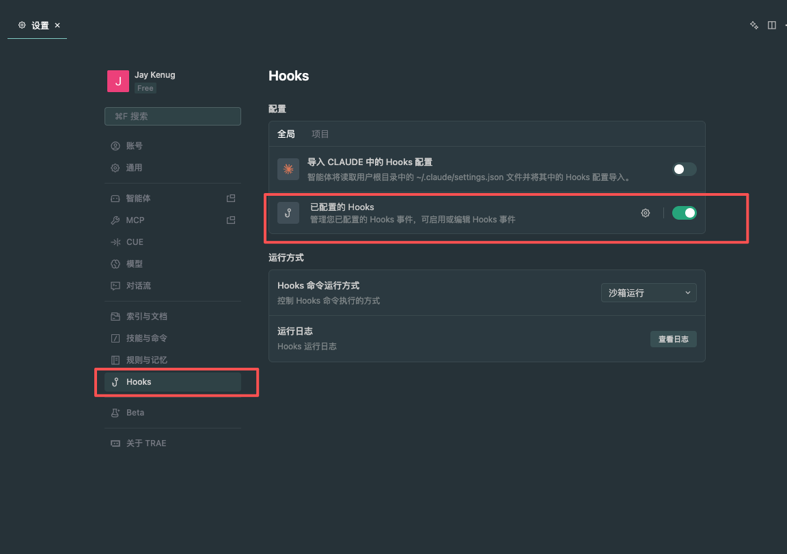
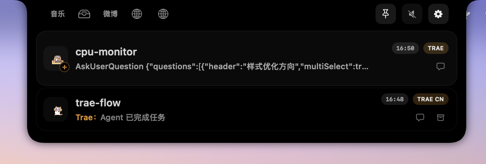
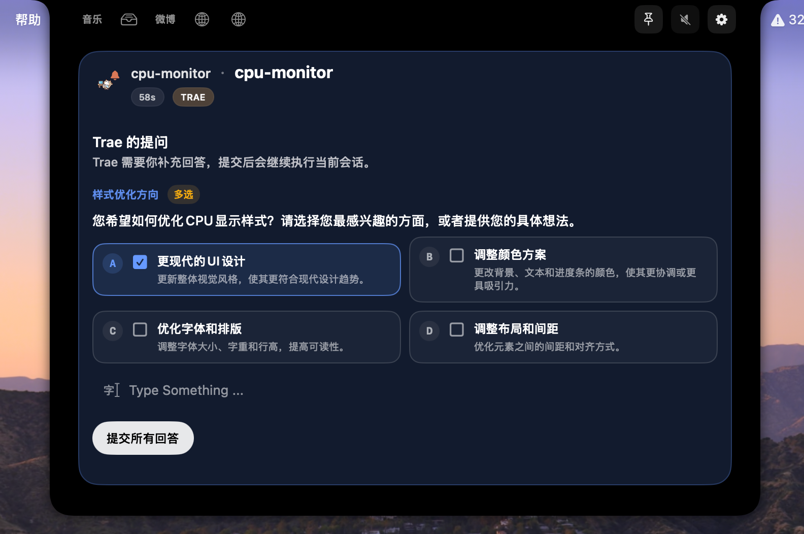
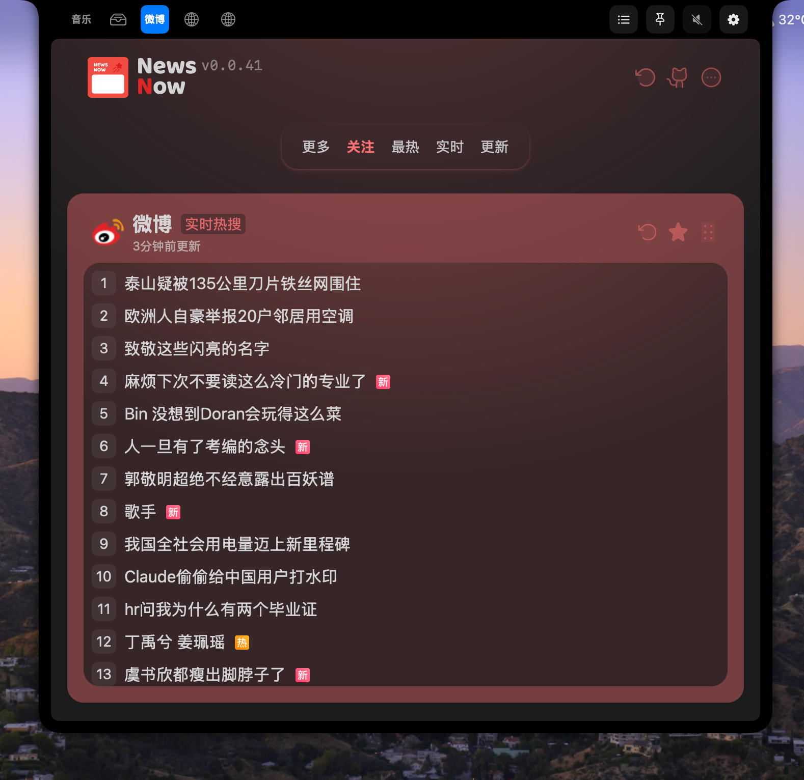
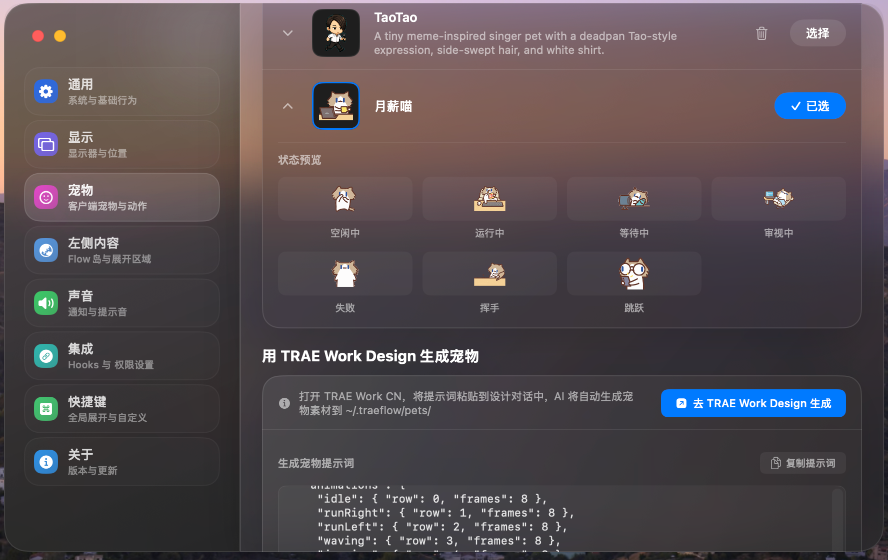
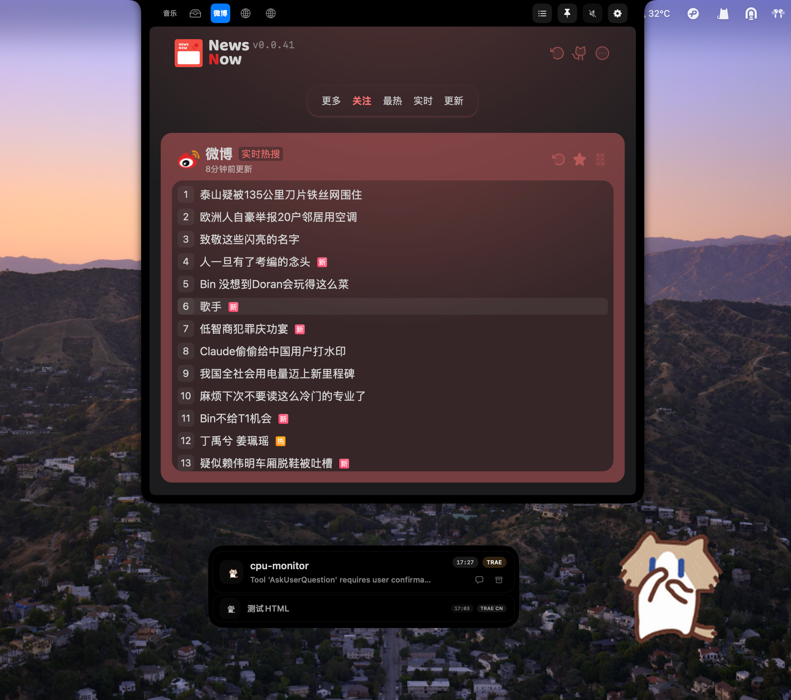
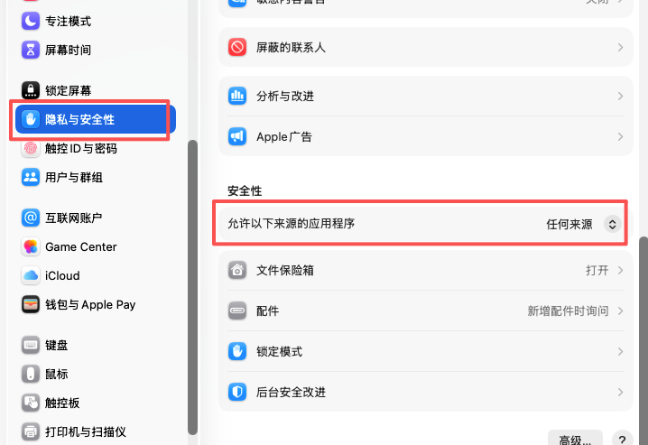

<h1 align="center">
  TRAE FLOW
</h1>
<p align="center">
  <b>利用 TRAE 的能力 · 创建专属于你的 Mac 灵动岛</b><br>
  <a href="#安装">安装</a> •
  <a href="#三条主线">三条主线</a> •
  <a href="#功能">功能</a> •
  <a href="#从源码构建">构建</a> •
  <a href="docs/privacy-policy.md">隐私政策</a>
</p>

<p align="center">
  
  
  
  
</p>

<p align="center">
  <sub>TRAE 任务丝滑上岛 · VibeCoding 任意组件上岛 · TRAE Work Design 一键创建电子宠物上岛</sub>
</p>

## 什么是 TRAE FLOW？

**TRAE FLOW 的核心理念是「利用 TRAE 的能力创建专属于你的 Mac 灵动岛」。**

市面上的灵动岛应用大多是「别人定义好的岛」——状态是固定的、功能是固定的、可用组件是固定的、宠物也是固定的。TRAE FLOW 不一样：它把灵动岛变成了**你自己的画布**。你关心的 TRAE 任务、你 VibeCoding 写的小组件、你用 TRAE Work Design 设计的电子宠物，都能上岛。

它同时解决了三件事：

- **TRAE 任务状态太分散** — 四个变体、多个窗口，很难一眼判断「谁需要我」。TRAE FLOW 让任务**丝滑上岛**，自动聚合、自动提醒、一键跳回。
- **灵动岛组件不够自由** — 现有方案大多是固定面板，用户只能看、不能放自己的东西。TRAE FLOW 让你通过 VibeCoding，把任意 HTML、数据看板、小工具**上岛**。
- **桌面缺少专属陪伴** — 很多效率工具冷冰冰的。TRAE FLOW 让你用 TRAE Work Design 轻松创建自己的电子宠物，让编码过程多一个会动、会反应、属于自己的伙伴。

> 从「看岛」到「造岛」——每个人都能造出不一样的岛，每个人都是自己产品的产品经理。

## 三条主线

TRAE FLOW 的三条主线对应三种 TRAE 能力和三个用户动作：

### 1. TRAE 任务动态丝滑上岛

通过 Trae 官方 Hook 协议，实时监听 `SessionStart`、`UserPromptSubmit`、`PreToolUse`、`PostToolUse`、`Stop`、`Notification` 事件，四个 TRAE 变体（TRAE / TRAE CN / TRAE WORK / TRAE WORK CN）的任务状态自动汇聚到 Flow 岛右侧。需要审批、追问、干预时，岛会自动展开；处理完即可一键跳回对应 IDE 窗口，无需在 Dock 和标签页里翻找。

### 2. VibeCoding 任意组件上岛

左侧功能岛完全开放：内置音乐控制、文件中转站、新闻热搜集合，更支持把本地 HTML 目录或任意远程网页直接渲染进灵动岛。通过 `traeFlowHint` JS Bridge，网页还能向灵动岛上推送提示或内容；文件改动通过 FSEvents 实时刷新。**你可以用 TRAE 写一个小组件，加到 FLOW 后下一秒它就出现在你的岛上。**

### 3. TRAE Work Design 一键创建电子宠物上岛

内置基于精灵表的桌面宠物系统，内置 月薪喵、Frieren 等多个主题。更支持从 `~/.traeflow/pets` 加载自定义宠物包，**让你可以用 TRAE Work Design 工作流生成自己的角色素材（已内置完整工作流提示词），一键放上岛**。宠物会随任务状态切换动画，还能拖拽到桌面、滚轮缩放，成为你的专属桌面陪伴。

<a id="功能"></a>

## 功能速览

按三条主线组织，每条主线对应一种 TRAE 能力：

**TRAE 任务动态丝滑上岛**

- 同时监视 TRAE / TRAE CN / TRAE WORK / TRAE WORK CN 四个变体
- 紧凑态显示各变体待处理任务计数，展开态呈现审批、追问、完成详情
- 一键跳回对应 TRAE 变体 IDE 窗口
- 对接 Trae 官方 Hook 系统（`SessionStart` / `UserPromptSubmit` / `PreToolUse` / `PostToolUse` / `Stop` / `Notification`）

**VibeCoding 任意组件上岛**

- 🎵 **音乐控制** — 系统「正在播放」面板，支持 Music.app / Spotify / 网易云音乐 / QQ 音乐，紧凑态自动切换
- 📦 **中转站** — 文件暂存区，支持拖入文件，AirDrop 一键分享
- 📰 **NewsNow** — 内置 NewsNow 远程实例，灵动岛中浏览新闻资讯
- ⛏ **Mineradio** — 内置 Mineradio Bridge 兼容层，灵动岛内播放音乐并显示歌词，支持网易云/QQ/酷狗登录
- 📄 **自定义区域** — 将本地 HTML 文件夹渲染到灵动岛中，支持 JS Bridge 向紧凑态推送限时通知，FSEvents 文件监听自动刷新
- 🌐 **网页嵌入** — 在灵动岛中直接嵌入任意远程网页，支持自定义名称、URL、图标，收起后可选保持后台运行

**TRAE Work Design 一键创建电子宠物上岛**

- 🐱 **桌面宠物** — 基于精灵表动画的 Codex 兼容宠物系统，可在 Flow 岛和桌面显示，支持拖拽 detach、滚轮缩放
- 内置多套主题包：TRAE FLOW / 月薪喵 / 光环小猫 / 鸡哥 ikun / Frieren / Homelander / Shinchan / TaoTao
- 支持从 `~/.traeflow/pets` 或 `~/.codex/pets` 加载自定义宠物包
- 项目内置 TRAE Work Design 完整工作流提示词，可一键生成自己的角色素材上岛

<a id="支持的变体"></a>

## 支持的变体

| 变体           | Bundle ID           | URL Scheme   | 官方 Hook 配置路径                      | Profile ID     |
| ------------ | ------------------- | ------------ | --------------------------------- | -------------- |
| TRAE         | `com.trae.app`      | `trae://`    | `~/.trae/hooks.json`              | `trae`         |
| TRAE CN      | `cn.trae.app`       | `trae-cn://` | `~/.trae-cn/hooks.json`           | `trae-cn`      |
| TRAE WORK    | `com.trae.solo.app` | `solo://`    | `~/.trae-solo/hooks.json`（实验性）    | `trae-work`    |
| TRAE WORK CN | `cn.trae.solo.app`  | `solo-cn://` | `~/.trae-solo-cn/hooks.json`（实验性） | `trae-work-cn` |

TRAE 和 TRAE CN 通过 Trae 官方 Hook 协议提供完整事件流支持。**调试中发现 TRAE WORK 系列虽未在设置界面暴露 Hook 入口，但实际可读取 hooks 配置**，TRAE FLOW 已为其预留配置路径与变体路由作为实验性支持，稳定性以 IDE 系列为主。\
需要在设置中启用Hooks。


## Flow 岛布局

### 紧凑态


- **左侧**：当前选中的功能视图（音乐 / 中转站 / NewsNow / Mineradio / 自定义区域 / 网页），正在播放音乐时自动切换到音乐。
- **右侧**：TRAE sparkles 图标 + 所有变体待处理/正在运行任务总数。

### 展开态




- **顶部**：功能切换栏，支持拖拽排序。
- **左侧**：当前功能的展开内容，或活跃会话详情（审批、追问、完成）。
- **右侧**：各变体待处理任务计数及跳回 IDE 按钮。

## 内置功能详情

### 🎵 音乐

系统「正在播放」面板，无需离开编码环境即可查看和控制音乐播放。

- **支持播放器**：Music.app、Spotify、网易云音乐、QQ 音乐
- **技术实现**：通过 MediaRemote 私有框架（dlopen 动态加载）获取系统级播放信息，AppleScript 作为备用方案
- **紧凑态**：18pt 圆角封面缩略图 + 截断曲目标题，无播放时显示灰色音符图标
- **展开态**：140pt 封面大图 + 曲目/艺术家/专辑信息 + 可拖拽进度条 + 完整播放控制（上一曲 / 播放暂停 / 下一曲），背景为封面主色调动态渐变

### 📦 中转站

轻量级文件暂存区，方便在不同应用间快速传递文件。

- **添加文件**：从任意位置拖入文件
- **分享文件**：通过 AirDrop 一键分享暂存的所有文件
- **管理文件**：展开态以 4 列网格展示图标和文件名，右键可移除单个文件
- **注意**：中转站文件仅在内存中暂存，退出应用后自动清空

### 📄 自定义区域

在灵动岛中渲染本地 HTML 目录和外部网站URL，支持完整的 Web 交互能力。




- **JS Bridge**：HTML 页面可调用 `window.webkit.messageHandlers.traeFlowHint.postMessage()` 向紧凑态推送限时通知
- **文件监听**：通过 FSEvents 监听文件变化，自动刷新 Flow 岛和设置预览
- **安全沙箱**：WebView 默认限制外部网络访问和 JavaScript 窗口创建；可配置允许网络访问和 `fetch` 请求
- **书签持久化**：沙箱外目录通过 Security-Scoped Bookmark 持久化访问权限

#### 预置示例

首次启动时自动创建一个自定义区域（默认启用，可在设置 > 左侧内容中手动关闭）：

| 区域                    | 说明                                                        |
| --------------------- | --------------------------------------------------------- |
| **TRAE Flow 自定义功能演示** | 交互式模板，展示 JS Bridge 推送提示、外部 API 请求、localStorage 计数器和系统数据监控 |

### 🌐 网页嵌入

在灵动岛中直接加载远程网页，支持编辑名称、URL 和图标，可在系统默认浏览器中打开当前页面，并可选择收起灵动岛后保持网页后台运行。

### 📰 NewsNow

内置 NewsNow 远程实例，无需配置即可在灵动岛中快速浏览新闻资讯。支持自定义实例地址，自动获取站点图标。

### ⛏ Mineradio

内置 Mineradio Bridge 兼容层，在灵动岛内直接播放 [Mineradio](https://mineradio.art/) 音乐并展示歌词。

- **平台支持**：网易云音乐、QQ 音乐、酷狗音乐
- **歌词显示**：紧凑态可展示当前歌词，展开态浏览完整播放器
- **后台播放**：收起灵动岛后仍通过离屏窗口保持 WebView 运行，音乐不间断
- **登录同步**：登录状态通过默认 Cookie 存储共享，支持在设置中查看/登出

### 🐱 内置宠物

基于精灵表（spritesheet）动画的桌面宠物系统，兼容 Codex 宠物规范。宠物会在 Flow 岛中展示不同状态的动画（空闲、运行、等待、跳跃等），陪伴编码过程。



支持将宠物拖拽到桌面显示，鼠标滚轮可调整宠物显示大小。

#### 内置宠物主题包

| 宠物             | ID           | 类型 |
| -------------- | ------------ | -- |
| **TRAE FLOW**  | `traeflow`   | 默认 |
| **月薪喵**        | `yuexinmiao` | 动物 |
| **光环小猫**       | `halokitten` | 动物 |
| **鸡哥 ikun**    | `ikun`       | 动物 |
| **Frieren**    | `frieren`    | 人物 |
| **Homelander** | `homelander` | 未知 |
| **Shinchan**   | `shinchan`   | 未知 |
| **TaoTao**     | `taotao`     | 人物 |

宠物主题包遵循 Codex 规范的 8 列 × 9 行精灵表格式（1536×1872，每帧 192×208），支持在设置面板中切换、预览，也支持从 `~/.traeflow/pets/` 或 `~/.codex/pets/` 加载自定义宠物。

<br />

## 安装

### 下载发布版本

1. 前往 [Releases](https://github.com/ccsonicc333/trae-flow/releases)。
2. 下载最新的 DMG。
3. 将 `TRAE FLOW.app` 拖到应用程序文件夹。
4. 启动应用并打开你要监视的 TRAE 变体。

> 首次启动时，macOS 可能要求确认应用或授予辅助功能 / Apple Events 权限以使用焦点和跳转功能。

> ⚠️ **未公证版本安装提示**
>
> 当前 GitHub Release 构建使用 ad-hoc 签名，**未经过 Apple 公证（Notarization）**。首次打开时，macOS Gatekeeper 可能会拦截并提示“无法打开，因为无法验证开发者”。
>
> 解决方法（任选其一）：
>
> - 在“系统设置” > “隐私与安全性”中，找到“已阻止使用 TRAE FLOW”提示，点击“仍要打开”。
>   
> - 右键点击应用图标，选择“打开”。
> - 在终端执行：
>   ```bash
>   xattr -d com.apple.quarantine /Applications/TRAE\ FLOW.app
>   ```

### 从源码构建

需要 macOS 14+ 和可构建 Xcode 项目及 Swift 6.1 `Prototype` 包测试的 Xcode 工具链。

```bash
git clone https://github.com/ccsonicc333/trae-flow.git
cd trae-flow

# Debug 构建
xcodebuild -project TraeFlow.xcodeproj -scheme TraeFlow -configuration Debug build

# Release 构建
xcodebuild -project TraeFlow.xcodeproj -scheme TraeFlow -configuration Release build
```

创建本地可分享的未签名测试包：

```bash
./scripts/package-unsigned.sh
```

## 工作原理

```text
TRAE / TRAE CN / TRAE WORK / TRAE WORK CN
  -> Trae 官方 Hook (SessionStart / UserPromptSubmit / PreToolUse / PostToolUse / Stop / Notification)
    -> TraeFlowBridge (--variant <value>)
      -> Unix socket (~/Library/Application Support/trae-flow/trae-flow.sock)
        -> HookSocketServer (变体路由)
          -> SessionStore
            -> SessionMonitor / NotchViewModel
              -> Flow Island (左: 功能视图 / 会话详情, 右: 变体计数 / 跳回)
```

实现要点：

- TRAE 和 TRAE CN 的 Hook 分别安装在 `~/.trae/hooks.json` 和 `~/.trae-cn/hooks.json`。
- Bridge 二进制（`TraeFlowBridge`）接受 `--variant <trae|trae-cn|trae-work|trae-work-cn>` 参数标记事件来源变体。
- `HookSocketServer` 中的变体路由将 `variant` 元数据字段映射到对应的 `SessionClientProfile`。
- Socket 路径默认为 `~/Library/Application Support/trae-flow/trae-flow.sock`，可通过 `TRAE_FLOW_SOCKET_PATH` 环境变量覆盖。
- Bridge 配置路径可通过 `TRAE_FLOW_BRIDGE_CONFIG` 环境变量覆盖。

## 系统要求

- macOS 14.0 或更高
- 带刘海的 MacBook 体验最佳，但也支持外接显示器
- 安装一个或多个 TRAE 变体应用

<br />

## 测试

```bash
# 全仓库回归测试
./scripts/test.sh

# 仅 Prototype 测试
swift test --package-path Prototype

# Xcode 单元测试
xcodebuild -project TraeFlow.xcodeproj -scheme TraeFlow -configuration Debug CODE_SIGNING_ALLOWED=NO test -only-testing:TraeFlowTests
```

## 致谢

TRAE FLOW 延续了 [ping-island](https://github.com/erha19/ping-island)、[vibe-notch](https://github.com/farouqaldori/vibe-notch)、[boring.notch](https://github.com/TheBoredTeam/boring.notch)、[claude-island](https://github.com/farouqaldori/claude-island)、[nookX](https://github.com/juyongkim/NookX) 等灵动岛风格代理监视器与功能软件的形态探索。在这些产品验证的形态基础上，TRAE FLOW 把注意力从「监视」转移到「创造」——让每个用户都能造出属于自己的岛。

## 项目愿景

- 后期拓展为 **TRAE 社区灵动岛组件 / 宠物板块**，大家可以分享自己创作的灵动岛组件、宠物，提升社区用户活跃度，基于用户创造性出圈。
- 推动 TRAE 应用周边生态发展，激发更多好的想法接入 TRAE 周边生态。

在过去这类工具是开发者的专属——你要懂 Swift、懂 macOS API、懂 Xcode 工程化，才能给 Mac 写一个灵动岛小组件。**TRAE FLOW 站在 TRAE 的肩膀上把这件事的门槛降到了零**：提供一个所想即所得的入口，面向更大的用户群体——产品经理、运营、学生、医生、老师、设计师——任何人只要有想法，就能立马让它在屏幕上跑起来。

## 许可证

Apache 2.0 — 详见 [LICENSE.md](LICENSE.md)。
